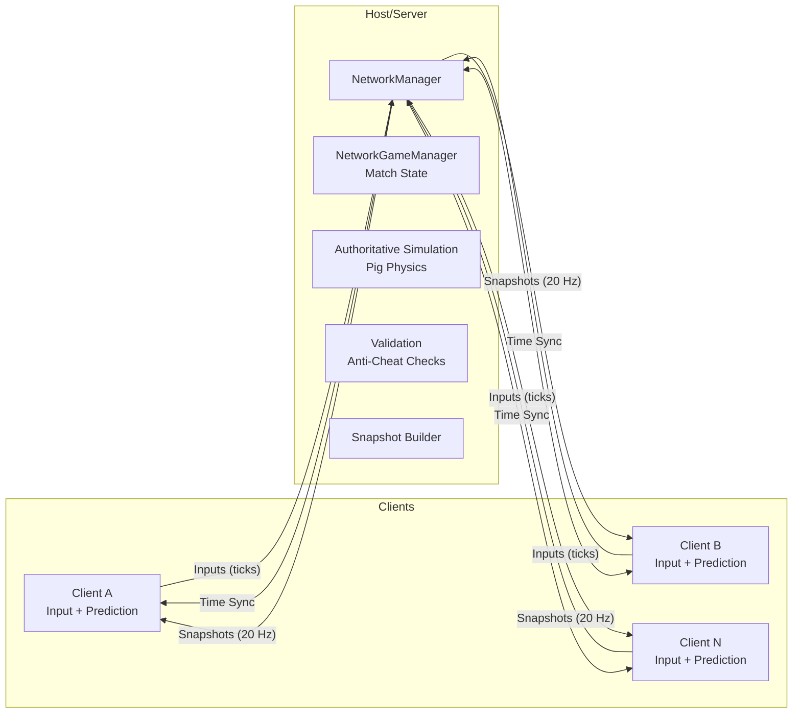

# PiggyRace

Arcade online racing where players ride boosty pigs around fun tracks. This repository is Netcode for GameObjects (NGO)–based: Unity 6.2 (URP) + NGO 2.5.0 with a server‑authoritative model, client prediction, and interpolation. UI uses TextMeshPro (TMP).

---

## How We Build This Together (You + Agent)
- Agent: scaffolds folders/scripts, writes tests first, applies small patches, explains changes.
- You: open Unity, run tests, press Play, give feedback, approve package/scene changes.
- Loop per step: propose → patch → you validate in Unity → iterate. The detailed step list lives in TODO.md.

## Project Structure
- Code: `Assets/Scripts/` by domain (`Core/`, `Gameplay/`, `UI/`).
- Tests: `Assets/Tests/EditMode` (pure logic) and `Assets/Tests/PlayMode` (runtime/scene).
- Scenes/Prefabs: `Assets/Scenes`, `Assets/Prefabs`, `Assets/Settings`.
- Packages: `Packages/manifest.json` (Unity 6.2, NGO 2.5.0, UTP).

Planned networking scripts will live under `Assets/Scripts/Networking/` (e.g., `NetworkGameManager`, `PlayerConnection`, `Spawning`).

## Architecture Snapshot

Key principles: server authoritative simulation; client-side prediction for local pig; reconciliation on server snapshots; interpolation for remote pigs; fixed-timestep motor for stability.

## NGO Usage (What we rely on)
- `NetworkManager` prefab configured with Unity Transport (UTP).
- `NetworkBehaviour` components for player controllers and the race game manager.
- RPCs (`ServerRpc`/`ClientRpc`) for input submission and events.
- `NetworkVariable<T>` for shared race state (phase, countdown, lap totals).
- `NetworkTransform` or custom transform sync + smoothing for remote players.
- Optional client-authoritative mode (per-pig) for extra-smooth local feel: owner simulates locally and sends state to host, which echoes to remotes. Use only for prototypes — not secure against cheating.
- Optional: Unity Relay + Lobby for discovery and NAT traversal.

## Development Setup
- Unity 6.2 with NGO 2.5.0 and Unity Transport. Input System enabled (already present). UI uses TextMeshPro (TMP).
- Editor: Fixed Timestep 0.0167s (60 Hz). Avoid frame-dependent logic in simulation.
- Tests: Window → General → Test Runner → Run All (or CLI flags in AGENTS.md).

## Step-by-Step Milestones
1) Plumbing: add packages, NetworkManager prefab, scenes (MainMenu, Lobby, Race).
2) Movement: `PigMotor` + `PigController` + follow camera.
3) Netcode core (NGO): ticks/time sync, input via `ServerRpc`, server sim on host, state sync via `NetworkVariable`/RPC, prediction + reconciliation on client, smoothing for remotes.
4) Race loop (TDD): checkpoints, lap tracker, spawns, countdown, HUD, results — with EditMode tests for lap/sector logic and minimal PlayMode smoke checks.
5) Resilience/polish: anti-cheat checks, rejoin/spectate, net-sim tuning.

See TODO.md for an actionable, checkpointed plan with “Agent does / You do” for each step.

## Contribution
- Small PRs, each with passing EditMode + PlayMode tests.
- Describe behavioral changes; attach screenshots/gifs for gameplay/HUD changes.

License: TBD

## Tools
- Input: Unity Input System
- UI: TextMeshPro (TMP)
- Camera: Cinemachine (optional)
 - Editor: Track Tools (Tools → PiggyRace → Track Tools) to quickly generate checkpoint loops and spawn grids.

## Testing Approach (TDD)
- Keep core rules in pure C# classes (no MonoBehaviour) and cover with EditMode tests. Example: `LapTrackerLogic` verifies ordered checkpoints, lap completion, final race state, and sector timings.
- Keep runtime glue thin (MonoBehaviours) and add light PlayMode tests where needed to validate wiring.
- Prefer server-authoritative code paths in tests: simulate server-side updates and assert NetworkVariables mirror expected state where feasible.
- Physics + prediction: `PigMotor` exposes a `Snapshot` with capture/restore for deterministic rewind/replay. EditMode tests cover snapshot/restore roundtrips to support reconciliation.

## Editor Track Tools
- Open: `Tools → PiggyRace → Track Tools`.
- Create Track Loop: specify checkpoint count, ellipse radii, start angle, and checkpoint trigger size; click "Create TrackManager + Loop" to generate a `TrackManager` with ordered `Checkpoint` children.
- Spawn Grid: set count, columns, row/column spacing; click "Add/Replace Spawn Points At Start" to populate spawn points behind checkpoint 0, aligned with its forward.
- Quick action: `Tools → PiggyRace → Create Track Loop (Quick)` uses defaults to create a loop fast.

## Minimal Race HUD
- Component: `PiggyRace.UI.RaceHUD`
- Shows: `Phase`, `Countdown`, and local `Lap/Total` using a TMP Text.
- How to use:
  - Create a Canvas → TextMeshPro - Text (UI) in your scene.
  - Add `RaceHUD` to the TMP object and assign its `TMP_Text` field (or let it auto-grab).
  - Ensure your player prefab has `LapTracker` and the scene has `NetworkGameManager`.

---

## Local Pig Prototype (offline)
- Components: `PigController` (MonoBehaviour) + `PigMotor` (pure logic).
- Purpose: quick local driving to test feel before wiring NGO.

How to use in a scene
- Create an empty GameObject named `Pig` and add `PigController`.
- Optional: add a kinematic `Rigidbody` to use physics transforms.
- Controls: W/S (throttle), A/D (steer), Space (brake), Shift (drift), Ctrl (boost).
- Tune fields in Inspector: speed/accel/drag, turn/ drift multipliers, boost, and `RotationSpeedDeg` for visual turn smoothing.

Tests
- EditMode: `PigMotorTests` validate acceleration/turning, drift turn rate, boost effect.
