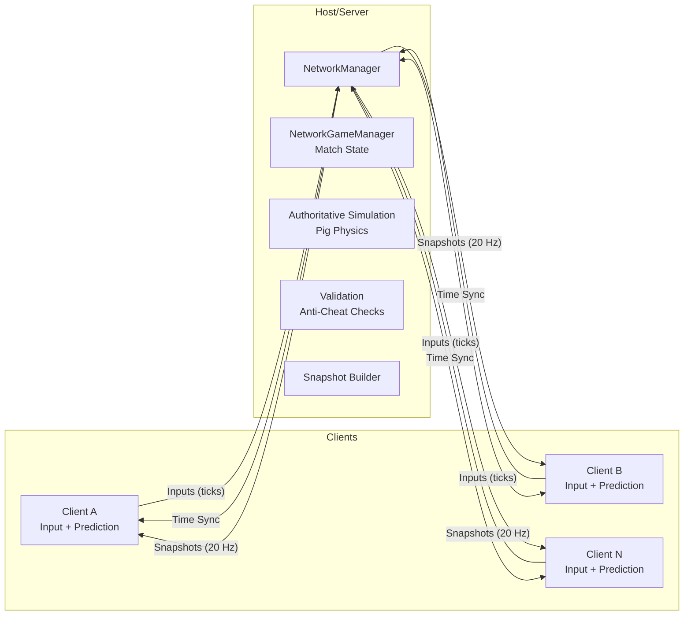

# PiggyRace

Arcade-y online racing game where players ride chaotic, boost-happy pigs around fun tracks. Built in Unity with a deterministic-ish, server-authoritative netcode design that keeps races tight and fair while feeling snappy on clients via prediction and interpolation.

---

## Overview
- Fast, session-based multiplayer races (2–8 players).
- Simple controls, high skill ceiling: drift, draft, boost, and bash.
- Server authoritative movement, client-side prediction, lag compensation.
- Spectator, rejoin-on-disconnect, quick rematch loop.

## Feature Highlights
- Core: Lobby, countdown, laps, checkpoints, results, rematch.
- Pigs: Lightweight physics, drift, charge/boost, item pickups (optional).
- Tracks: Multilap, shortcuts, split timing, hazards.
- Netcode: Unity Netcode for GameObjects (NGO) + Unity Transport. Snapshot interpolation, input ticks, rewind checks.
- UX: Input System bindings, split HUD (position, lap, delta, minimap), camera follow.

## Tech Stack
- Engine: Unity 6.2 (URP) — repository already configured.
- Multiplayer: Unity Netcode for GameObjects 2.5.0 with Unity Transport.
- Optional services: Unity Relay + Lobby for NAT traversal and match discovery.
- Input: Unity Input System (`InputSystem_Actions.inputactions`).
- Versioning: Git + `.sln`/.csproj managed by Unity.

> Note: The current repo contains the Unity scaffold and assets; gameplay and netcode systems are to be implemented following the plan below.

---

## Project Structure (proposed)
```
Assets/
  Scenes/
    MainMenu.unity
    Lobby.unity
    Race.unity
  Prefabs/
    Pig/
      PigPlayer.prefab
      PigGhost.prefab
    Track/
      Checkpoint.prefab
      LapTrigger.prefab
    Systems/
      NetworkManager.prefab
      GameHUD.prefab
  Scripts/
    Core/
      GameBootstrap.cs
      SceneLoader.cs
      GameSettings.cs
      TickManager.cs
      TimeSync.cs
    Gameplay/
      PigController.cs
      PigMotor.cs
      DriftController.cs
      ItemSystem.cs
      Track/Checkpoint.cs
      Track/LapTracker.cs
      Track/TrackManager.cs
      Camera/ChaseCamera.cs
    Netcode/
      NetworkGameManager.cs
      PlayerSpawner.cs
      PlayerConnection.cs
      NetPigState.cs
      Input/PlayerInputBuffer.cs
      Prediction/ClientPredictor.cs
      Prediction/Reconciler.cs
      Interpolation/SnapshotBuffer.cs
    UI/
      HUDController.cs
      CountdownUI.cs
      ResultsUI.cs
    Services/
      LobbyService.cs (optional)
      RelayService.cs (optional)
  Settings/
```

---

## High-Level Architecture


### Key Principles
- Server authoritative: Only the server decides true positions and race progression.
- Client-side prediction: Clients simulate their own pig immediately using the same inputs and a mirrored motor.
- Reconciliation: On receiving state from server, clients correct drift using buffered input history.
- Snapshot interpolation: Non-owned entities (other players) are rendered smoothly with buffered snapshots.
- Determinism-lite: Use consistent physics parameters, fixed tick, and gated randomness to keep client/server close.

---

## Networking Design
- Transport: Unity Transport (UTP), NGO for object lifecycle, RPCs, and NetworkVariables where appropriate.
- Tick Model:
  - Simulation tick: 60 Hz FixedUpdate (configurable).
  - Network send rate: 15–20 Hz state snapshots.
  - Input rate: 60 Hz compact input frames, batched per send.
- Ownership:
  - `PigPlayer`: owned by its client for input; server is authority for state.
  - `NetworkGameManager`: server-owned, controls race phases.
- Synchronization:
  - Inputs: Client → Server via `ClientRpc`/`ServerRpc` or NGO custom messaging; buffered by tick.
  - State: Server → Clients via delta-compressed snapshots (position, velocity, orientation, grounded, drift/boost state, checkpoint index, lap).
  - Events: Start/finish, item hits, collisions via RPCs or event channels.
- Lag Compensation:
  - Input timestamping, server rewind for checkpoint/hit validation when needed.
  - Client interpolation delay buffer (~100–150 ms) for remote entities.
- Anti-Cheat:
  - Server validates max speed, acceleration, boost budget, checkpoint order, wall riding exploits.
  - Server simulations ignore client-proposed positions.

---

## Core Systems
- TickManager: Central fixed tick, exposes current tick ID; ensures consistent stepping on server and client.
- TimeSync: Round-trip measurement and smoothing for client clock offset; sets interpolation delay.
- PigMotor: Minimal physics motor using forces/curves; deterministic-friendly where possible.
- ClientPredictor: Runs local pig using latest inputs immediately; records states for reconciliation.
- Reconciler: On snapshot, find matching tick, correct position/velocity; re-simulate buffered inputs.
- SnapshotBuffer: For remote pigs, buffer and interpolate between snapshots; optional extrapolation.
- TrackManager + LapTracker: Checkpoints with strict ordering and leniency windows, lap counting, split times.
- NetworkGameManager: Race lifecycle (Lobby → Countdown → Green → Results), spawns players, manages rematch.
- PlayerSpawner: Grid spawning with seeding for fair starts.
- HUDController: Countdown, position, lap/sector times, delta to leader, minimap hooks.

---

## Data Model (examples)
- NetPigState (snapshot):
  - tick, position (x,y,z), rotation (yaw), velocity (x,z), grounded, drift angle, boost charge, checkpointIndex, lap.
- InputFrame:
  - tick, throttle, steer, brake, drift, boost, itemUse.
- RaceState:
  - phase, countdownTime, raceTime, players[], trackId, settings.

---

## Scenes & Flow
1. Main Menu
   - Local host, join via IP/Relay code, training mode.
2. Lobby
   - Player list, ready states, track selection, server-only start.
3. Race
   - Countdown → Racing → Results → Rematch or back to Lobby.

---

## Development Setup
- Unity: Use Unity 6.2 editor (URP) compatible with NGO 2.5.0.
- Packages:
  - Netcode for GameObjects
  - Unity Transport
  - Input System (already present)
  - Cinemachine (optional for camera)
  - Relay + Lobby (optional)
- Editor Settings:
  - Fixed Timestep: 0.0166667 (60 Hz) or 0.02 (50 Hz) — choose and stick to it.
  - Disable variable timestep where determinism matters (avoid TimeScale tricks in simulation code).

---

## Building Blocks: Implementation Notes
- Physics Motor
  - Use `Rigidbody` with constraints or a kinematic motor with custom integration.
  - Favor explicit integration and damping to help determinism.
  - Keep collision layers simple; pre-bake track colliders.
- Inputs
  - Drive an `InputFrame` builder per tick from `Input System` actions.
  - Quantize inputs (e.g., steer as int16) for smaller payloads.
- Serialization
  - Custom serializers for `NetPigState` to minimize bandwidth (delta, quantization, bit packing if needed).
- Reconciliation Window
  - Keep last 500–800 ms of input frames for safety; cap to avoid memory growth.
- Interpolation
  - Maintain ~2–6 snapshots in buffer; dynamically adjust based on jitter.

---

## Local Run (developer loop)
- Start as Host: Press Play with Host mode to run server+client in one editor.
- Second Client: Build & Run a standalone player, join host IP (or Relay code when enabled).
- Profiling: Use the Network Profiler module and custom on-screen stats (RTT, jitter, tick drift, packet loss).

---

## Testing Strategy
- Unit
  - Input buffering, reconciliation math, snapshot interpolation.
- Integration
  - Join/leave flows, ready-up, countdown sync, lap counting, checkpoint ordering.
- Playtests
  - High-latency simulation using transport’s network simulator; ensure fairness and feel.
- Tools
  - Ghost replay recording (server-side states) for regression on tracks.

---

## Roadmap / TODO
See TODO.md for the full phased task list.

---

## Contribution Guidelines
- Keep PRs focused; one system or feature per PR.
- Write small, focused tests for math-heavy or netcode-critical logic.
- Profile in network conditions before merging netcode changes.
- Document public components with brief XML docs; keep README architecture current.

## License
TBD.

---

## FAQ
- Why NGO over Mirror/Photon?
  - Tight Unity integration, open-source, and sufficient for an authoritative model with UTP. Mirror/Photon are viable; this repo selects NGO to stay first-party.
- Will this run peer-to-peer?
  - Architecture supports host-client (listen server). Dedicated server build is recommended for stability; Relay can bridge clients.
- Deterministic physics?
  - Full determinism is not required; prediction + reconciliation closes the gap. Keep motor math simple and consistent across client/server.

---

Happy racing and oink oink!
