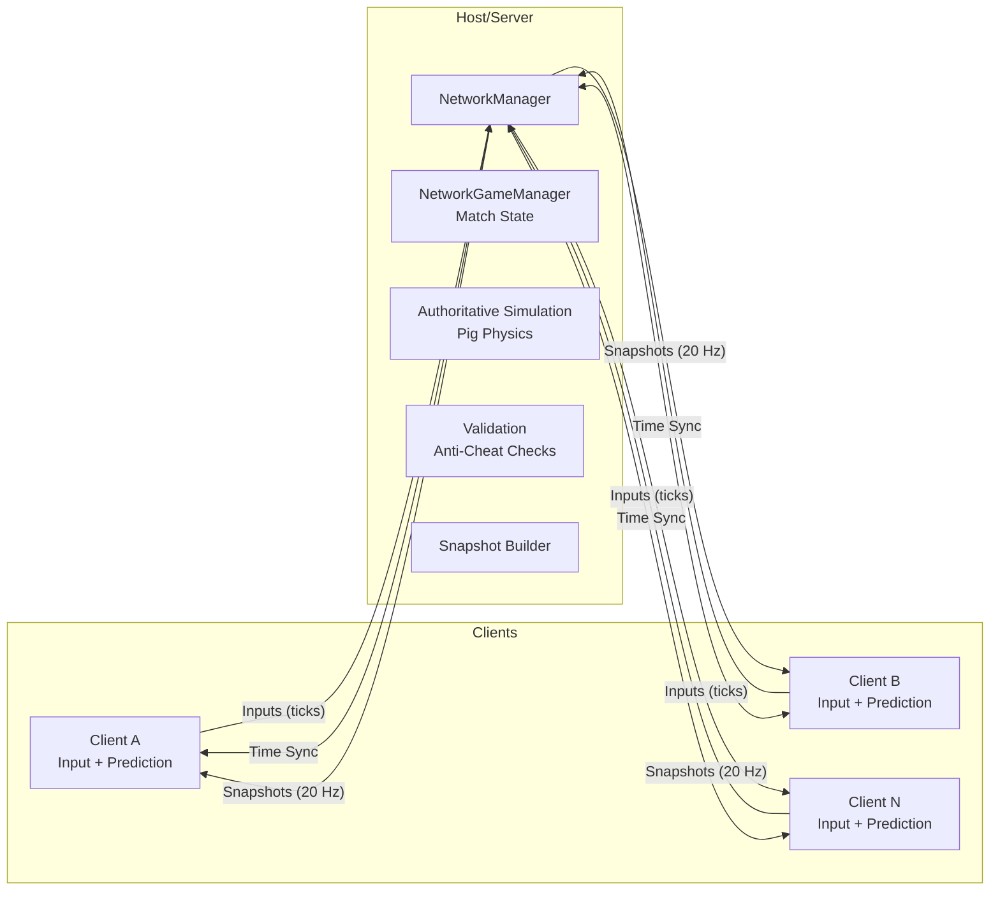

# PiggyRace

Arcade online racing where players ride boosty pigs around fun tracks. Built with Unity 6.2 (URP) and Netcode for GameObjects (NGO) 2.5.0 using a server-authoritative model plus client prediction and interpolation.

---

## How We Build This Together (You + Agent)
- Agent: scaffolds folders/scripts, writes tests first, applies small patches, explains changes.
- You: open Unity, run tests, press Play, give feedback, approve package/scene changes.
- Loop per step: propose → patch → you validate in Unity → iterate. The detailed step list lives in TODO.md.

## Project Structure
- Code: `Assets/Scripts/` by domain (`Core/`, `Netcode/`, `Gameplay/`, `UI/`).
- Tests: `Assets/Tests/EditMode` (pure logic) and `Assets/Tests/PlayMode` (runtime/scene).
- Scenes/Prefabs: `Assets/Scenes`, `Assets/Prefabs`, `Assets/Settings`.
- Packages: `Packages/manifest.json` (Unity 6.2, NGO 2.5.0, UTP).

## Architecture Snapshot

Key principles: server authoritative simulation; client-side prediction for local pig; reconciliation on server snapshots; interpolation for remote pigs; fixed-timestep motor for stability.

## Development Setup
- Unity 6.2 with NGO 2.5.0 and Unity Transport. Input System enabled (already present).
- Editor: Fixed Timestep 0.0167s (60 Hz). Avoid frame-dependent logic in simulation.
- Tests: Window → General → Test Runner → Run All (or CLI flags in AGENTS.md).

## Step-by-Step Milestones
1) Plumbing: add packages, NetworkManager prefab, scenes (MainMenu, Lobby, Race).
2) Movement: `PigMotor` + `PigController` + follow camera.
3) Netcode core: ticks/time sync, input send, server sim, snapshots, prediction/reconciliation.
4) Race loop: checkpoints, lap tracker, spawns, countdown, HUD, results.
5) Resilience/polish: anti-cheat checks, rejoin/spectate, net-sim tuning.

See TODO.md for an actionable, checkpointed plan with “Agent does / You do” for each step.

## Contribution
- Small PRs, each with passing EditMode + PlayMode tests.
- Describe behavioral changes; attach screenshots/gifs for gameplay/HUD changes.

License: TBD

---

## Tractor Prototype (offline, no Netcode)
- Components: `TractorMotor` (MonoBehaviour) + `TractorModel` (pure logic).
- Purpose: quick local driving to test feel before wiring NGO.

How to use in a scene
- Create an empty GameObject named `Tractor` and add `TractorMotor`.
- Optional: add a `Rigidbody` (no gravity needed for flat test) to use physics transforms.
- Set `UseInput = true` for WASD/Space control (Input System keyboard supported); or set `UseInput = false` and drive `Throttle/Steer/Brake` via another script/Timeline.
- Tune fields: `MaxSpeed`, `Accel`, `BrakeDecel`, `TurnRateDeg` on the component.
- Press Play and drive around a flat plane. Add a simple camera to follow, or assign your existing follow rig.

Tests
- EditMode: `TractorModelTests` validate acceleration, turning, and drag.
- PlayMode: `TractorMotorPlayModeTest` sanity-checks forward motion and turning.
